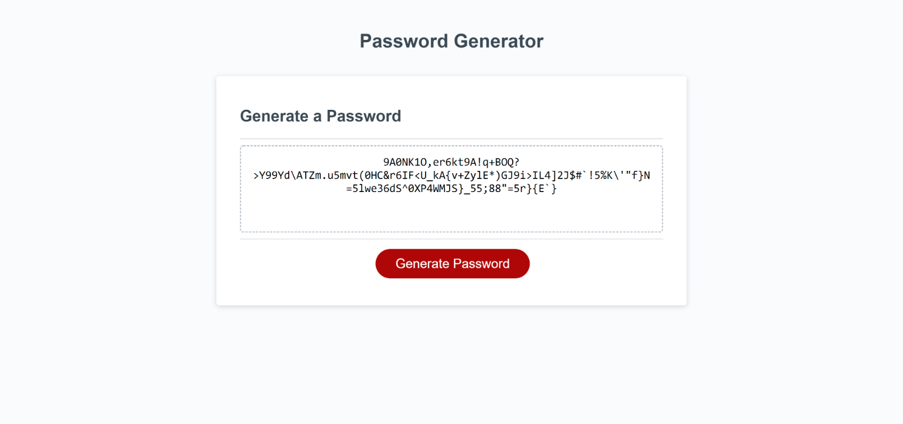

# Password Generator

## Project Description
I was tasked with creating the logic for a password generating application that would let the user choose different constraints for their randomly generated password and then display their randomly generated password in the application.

## Project Guidelines
* User must be able to select a password length between 8 and 128 characters.
* User must be able to select any combination of numerical, lowercase, uppercase, and special characters.
* When the generate password button is clicked a randomly generated password that follows the user's selected constraints should appear on the page.

## Screenshot of completed application:

## Link to deployed application:
https://carlschr.github.io/password-generator/
